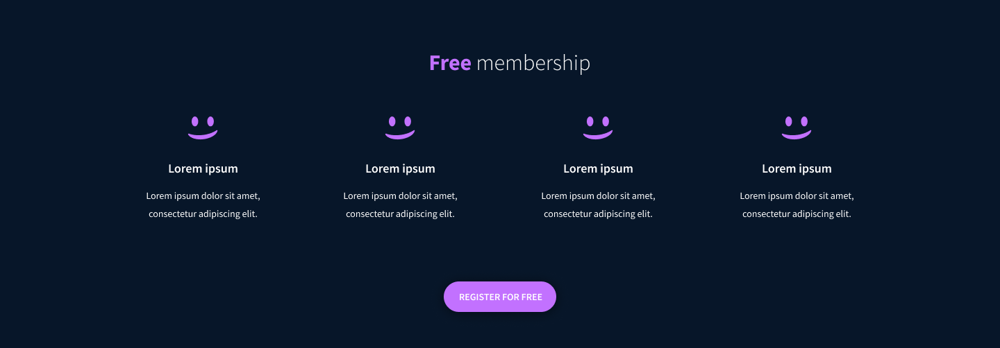

# SMILE SCHOOL HOME PAGE
This is a simple project that displays smile school landing page. In this project I have improved my css skills most importantly getting the layout right.

## Introduction 

## Testimonial Section

## Tutorials Section

## Membership Section

## FAQ  Section

## Footer

# BUILT WITH
I built this project using the following technologies
- **HTML 5**
- **CSS 3**
