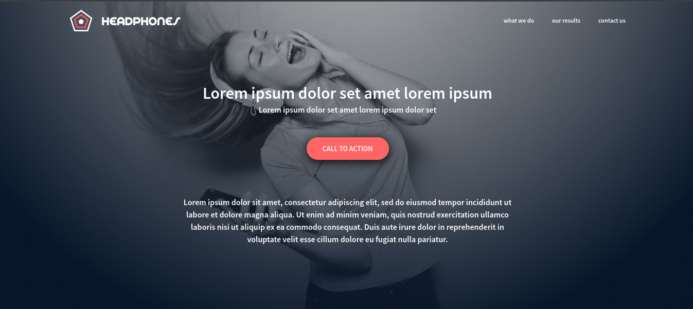

# HeadPhones Website

## Introduction
Welcome to the HeadPhones website! This project is a responsive, visually appealing site showcasing various aspects of a fictional company called HeadPhones. The site includes sections such as "What we do," "Our results," and "Contact us," each designed with a focus on aesthetics and usability. The goal of this project is to demonstrate proficiency in HTML, CSS, and responsive web design techniques.

## Screenshot

[View live site](https://headphones-a05.netlify.app/)

## Challenges Faced
During the development of this project, several challenges were encountered:
1. **Responsive Design**: Ensuring that the layout and design remained consistent and usable across various screen sizes was a major challenge. This required extensive use of media queries and flexible layout techniques like Flexbox.
2. **CSS Organization**: Keeping the CSS file organized and maintaining a DRY (Don't Repeat Yourself) approach was challenging, especially as the styles grew more complex.
3. **Cross-Browser Compatibility**: Ensuring the website looked and functioned correctly across different browsers involved extensive testing and sometimes browser-specific tweaks.
4. **Accessibility**: Achieving good color contrast and making the website accessible to all users required careful selection of colors and thoughtful design choices.

## What I Learned
Through this project, I gained valuable experience and insights, including:
1. **Responsive Design Principles**: Deepened my understanding of how to create layouts that adapt seamlessly to different screen sizes using media queries and flexible units.
2. **CSS Best Practices**: Learned how to better organize CSS using custom variables, consistent naming conventions, and grouping related styles to keep the codebase maintainable and scalable.
3. **Flexbox**: Improved my proficiency with Flexbox, which was crucial for creating flexible and responsive layouts.
4. **Web Accessibility**: Became more aware of the importance of web accessibility and learned techniques to ensure that web content is accessible to all users, including those with disabilities.

## Built With
- **HTML5**: The structure of the website is built with semantic HTML5 elements, ensuring the content is well-organized and accessible.
- **CSS3**: Custom styles are written in CSS3, including the use of variables, Flexbox, and media queries to create a responsive and visually appealing design.
- **Custom Fonts**: The website includes custom fonts loaded via `@font-face` to enhance the overall typography and user experience.
- **Font Awesome**: Icons from Font Awesome are used to improve the visual aesthetics and usability of the website.

Thank you for visiting the HeadPhones website! I hope you enjoy exploring it as much as I enjoyed creating it.
